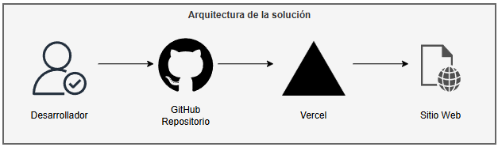

# 🚀 Sistema de Login Web

Proyecto de sistema de login web.

---

## 🧪 Tecnologías utilizadas

- Netlify
- HTML, CSS, JavaScript (aplicación bajo prueba)

---

## ⚙️ ¿Qué hace este proyecto?

✔ Simula un sistema real de login/logout   
✔ Despliega automáticamente en cada `push` o `pull request`

---

## 🧩 Arquitectura de la solución

El flujo de la solución está diseñado para simular un entorno real:

1. El desarrollador realiza un push al repositorio.
2. Netlify despliega automáticamente la aplicación web.



---

## 📁 Estructura del Proyecto

```
├── index.html                      # Página principal de login
├── success.html                    # Página de éxito después del login
├── assets/                         # Recursos estáticos
│   └── icons/                      # Iconos del proyecto
│       └── iconoIndex.png          # Icono principal
├── css/
│   └── styles.css                  # Estilos CSS completos
├── js/
│   ├── login.js                    # Lógica de autenticación y validación
│   └── success.js                  # Funcionalidad de la página de éxito
├── .gitignore                      # Archivos a ignorar por Git
└── README.md                       # Archivo de explicación del proyecto
└── netlify.toml                    # Archivo de configuración
```
---

## 🛠️ Instalación y uso local

```bash
git clone https://github.com/dmelchor24/website-app.git
cd website-login
python -m http.server 5500
```
**Acceder a la aplicación:**
   - Abrir `http://localhost:5500` en el navegador
   - O usar la demo en vivo: https://website-login-test.netlify.app

---

## 🔧 Configuración

### Personalizar Credenciales
Editar el archivo `js/login.js` para agregar nuevas credenciales:

```javascript
const TEST_CREDENTIALS = {
    'testuser': 'testpass123PQ',
    'tu_usuario': 'tu_contraseña'
};
```

---

**Nota**: Este sistema está diseñado específicamente para pruebas y desarrollo. No usar en producción sin las medidas de seguridad apropiadas.